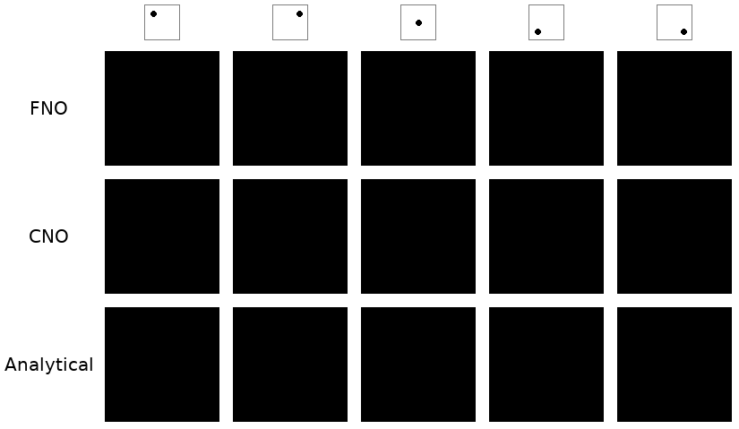
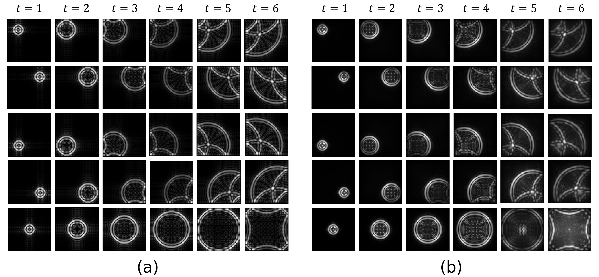
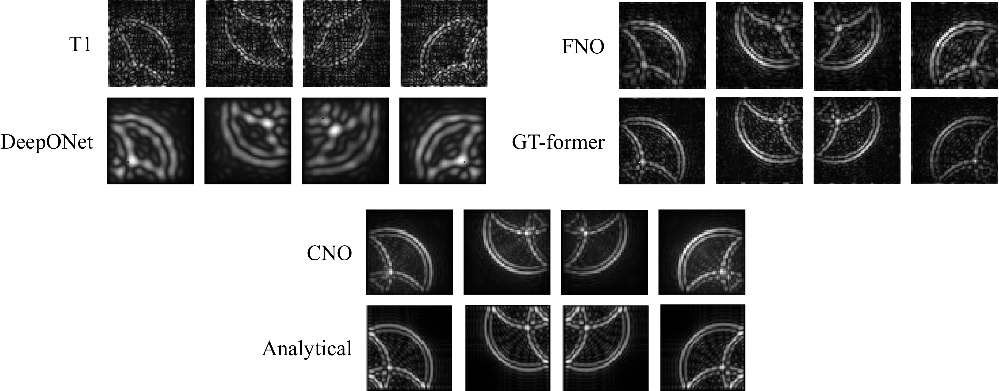

# Can Data-Driven Dynamics Reveal Hidden Physics? There Is A Need for Interpretable Neural Operators
<div align="center">

</div>

This repository provides the official source code and implementation for the paper: **"Can Data-Driven Dynamics Reveal Hidden Physics? There Is A Need for Interpretable Neural Operators"**

**Wenhan Gao**\*, **Jian Luo**\*, Fang Wan, Ruichen Xu, Xiang Liu, Haipeng Xing, Yi Liu<sup>†</sup>

\* Equal contribution

<sup>†</sup> Corresponding Author

<p align="center">


<em>Animation demonstrating how a trained Neural Operator captures the complex spatio-temporal dynamics of wave propagation.</em>
</p>

Our full paper is available on [ArXiv](https://arxiv.org/pdf/2510.02683v1).

## 📖 Introduction
Across diverse areas of science and engineering, researchers aim to understand how physical systems behave under varying parameters, such as different initial conditions, external forcing, or coefficient functions. Simulating such systems with traditional numerical solvers is often computationally prohibitive, as every change in parameters requires re-solving the governing equations.

Recently, Neural Operators (NOs) have emerged as a powerful, data-driven paradigm. They learn the mapping from an input function space to a solution function space, and once trained, their forward inference is orders of magnitude faster than traditional methods.

Despite the successes of NOs in fields like climate modeling and fluid dynamics, their explainability and internal learning mechanisms remain underexplored. Understanding how a model makes its predictions is critical, especially when applied to high-stakes scientific tasks like forecasting natural disasters. This project addresses this gap by:

- Proposing a method to explain the prediction-making process of neural operators, revealing whether they have learned the physics hidden in the data.

- Demonstrating experimentally that neural operators can indeed learn underlying physical patterns, such as spatial dependencies, from data.

- Highlighting the critical need to incorporate known physics priors (inductive biases) into the network architecture to ensure models are not only accurate but also consistent with fundamental physical principles.

## 🔬 Core Findings & Visualization
Our research investigates the learning mechanisms of neural operators by visualizing the model's "Effective Receptive Field" (ERF), which offers an intuitive way to see what the model has learned.

1. Neural Operators Can Learn Physics From Data
      - We found that well-trained neural operators can accurately capture the spatial dependencies in physical systems. As shown below, the dependency patterns learned by the model closely match the analytical solution derived from the wave equation.

<p align="center">



<em><b>Fig 1.</b> Comparison of spatial dependencies for wave propagation. (Left) Analytical dependencies derived from the governing equations. (Right) Dependencies learned by a neural operator, demonstrating its ability to strongly approximate the underlying physics.</em>
</p>

2. Different Architectures Exhibit Varying Learning Capabilities
      - Not all model architectures learn physical details with the same fidelity. We compared five mainstream neural operator architectures and found significant differences in their performance. Models like CNO and Galerkin Transformer, whose weights are defined spatially and whose activations are applied directly on a grid, perform better at capturing fine-scale wave patterns.

<p align="center">



<em><b>Fig 2.</b> Comparison of the Effective Receptive Field (ERF) learned by different neural operator architectures on the wave equation. While all models capture the coarse patterns, their ability to learn fine-grained details varies.</em>
</p>

3. The Importance of Embedding Physics Priors
      - To improve the learning efficiency, generalization, and explainability of the models, we advocate for embedding known physical priors (e.g., symmetries) directly into the network architecture. This approach constrains the model's search space to a physically meaningful subspace, proving more effective and reliable than simply adding physics-based constraints to the loss function.

<p align="center">


<em><b>Fig 3.</b> (Left) Enforcing physics priors constrains the learning space to a subspace of operators that respect those principles, leading to more robust results. (Right) In a climate prediction task, rotational symmetry is a key prior: rotating the input atmospheric properties (e.g., pressure fields) should result in a correspondingly rotated temperature prediction.</em>
</p>

## 🚀 Getting Started
To set up the environment, start by installing the required dependencies from the project's root directory. It is highly recommended to do this within a virtual environment (Python 3.9 and CUDA 11.3).

```
pip install -r requirements.txt

```

<details>
<summary><b>⚠️ Installation Note:</b></summary>

Due to issues with the original experimental machine's environment, the command above may fail. If it does, please follow this specific installation order:


First, install core scientific computing libraries:
```
pip install scipy h5py
```
Install a specific version of PyTorch:
This project was tested with torch==1.12.1. Please visit the PyTorch website's previous versions page, find the appropriate command for your CUDA version, and run it. For example, with CUDA 11.3:
```
pip install torch==1.12.1+cu113 torchvision==0.13.1+cu113 torchaudio==0.12.1
```
Install remaining dependencies and enforce numpy version:
Check requirements.txt and manually install the remaining packages. Pay special attention to the numpy version and ensure it matches what is specified in the file, which may require a downgrade:

```
pip install numpy==1.23.5
```

</details>

### Data Generation
Before starting the training, you must generate the simulation data. Navigate to the data directory and execute the script:

```bash
cd data
bash generation.sh
cd ..  # Return to the project root
```

This script will generate the .hdf5 files used for training and testing.

### Running Experiments
We provide convenient shell scripts to run training and testing.

To train a model:
```
bash sh/run_train.sh
```

To test a model:
```
bash sh/run_test.sh
```


# 📂 Repository Structure
```
Explaiable_NOs/
├── config
│   ├── model_config
│   │   ├── CNO
│   │   ├── DON
│   │   ├── FNO
│   │   ├── GT
│   │   └── T1
│   └── train_config
├── data
│   ├── generation.sh
│   ├── preview.ipynb
│   ├── wave_generation.py
│   └── wave_visulazation.py
├── models
│   ├── gt_libs
│   ├── CNO.py
│   ├── DON.py
│   ├── FNO.py
│   ├── GalerkinTransformer.py
│   └── ...
├── settings
│   ├── data_module.py
│   ├── model_module.py
│   └── properties.py
├── sh
│   ├── run_test.sh
│   └── run_train.sh
├── utils
│   └── utilities3.py
├── README.md
├── requirements.txt
├── test_position.py
└── train.py
```

# Looking Forward
Neural operators have already demonstrated remarkable promise as data-driven tools for simulating complex physical systems. However, their success hinges not only on predictive accuracy but also on our ability to explain what has been learned and to align it with physical principles. We believe that explainable neural operators can be transformed from fast emulators into engines for scientific discovery. When combined with architectures that embed physical priors, they can become reliable predictive tools and interpretable models that reveal new insights about the natural world.

# Citation
If you use our work or code in your research, please cite our paper:
```bibtex
@misc{gao2025datadrivendynamicsrevealhidden,
      title={Can Data-Driven Dynamics Reveal Hidden Physics? There Is A Need for Interpretable Neural Operators},
      author={Wenhan Gao and Jian Luo and Fang Wan and Ruichen Xu and Xiang Liu and Haipeng Xing and Yi Liu},
      year={2025},
      eprint={2510.02683},
      archivePrefix={arXiv},
      primaryClass={cs.LG},
      url={[https://arxiv.org/abs/2510.02683](https://arxiv.org/abs/2510.02683)},
}
```
